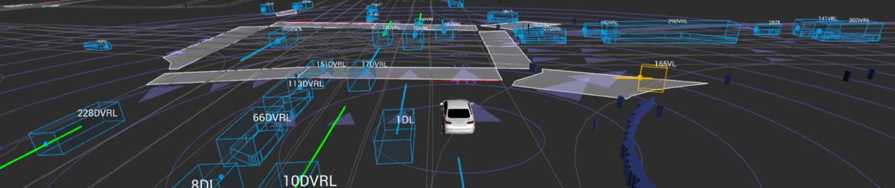
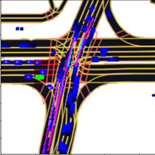
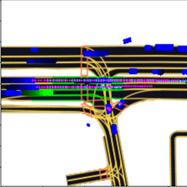

# Motion Prediction for Autonomous Vehicles - Lyft Level 5 Benchmark

This repository contains the code and models for the Deep Learning final project, focusing on motion prediction for autonomous vehicles using the Lyft Level 5 dataset. The project explores and compares several deep learning architectures, starting with a ResNet-50 baseline and progressing to more advanced Transformer-based models like Vision Transformer (ViT) and Data-efficient Image Transformer (DeiT).
This project is built on **[L5Kit](https://github.com/woven-planet/l5kit)**, a library designed for autonomous driving motion prediction.



## Project Overview

Motion prediction is a cornerstone of the modern autonomous driving stack, serving as the essential link between environmental perception and safe motion planning. An autonomous vehicle's ability to navigate complex, dynamic environments is fundamentally dependent on its capacity to anticipate the future actions of other road users. This project tackles this challenge by developing models that predict the future 5-second trajectories of agents (vehicles, cyclists, pedestrians) based on their past movements and the surrounding map context.

The core methodology involves:

1.  **Data Preprocessing**: Converting raw log data from the Lyft dataset into multi-channel, agent-centric, bird's-eye view (BEV) raster images.
2.  **Model Development**: Implementing and training three distinct architectures:
      * **ResNet-50**: A state-of-the-art CNN used as a strong baseline.
      * **Vision Transformer (ViT-B/16)**: A Transformer-based model explored for its ability to capture global scene context.
      * **Data-efficient Image Transformer (DeiT)**: The final, most performant model, which leverages a novel distillation strategy to train a Vision Transformer efficiently without massive datasets.
3.  **Evaluation**: Comparing the models based on the official competition metric, Negative Log-Likelihood (NLL), and the Average Displacement Error (ADE).

The results demonstrate a clear improvement in performance and training stability when transitioning from a CNN to a Transformer-based architecture, with the DeiT model achieving the best results.

## Repository Structure

The repository is organized as follows to ensure clarity and reproducibility:
```bash
.
├── data/                       # Directory for the Lyft dataset.zarr
├── models/
│   ├── configs/                # filesConfiguration file for training parameters
│   │   ├── baseline_res50_config.yaml
│   │   ├── vit_b16_config.yaml         
│   │   └── vit_deit_config.yaml 
│   ├── BaselineRes50Model.py   # Baseline ResNet-50 Model Class
│   ├── ViTDeitModel.py         # Data-efficient Image Transformer (DeiT) Model Class
│   └── ViTModel.py             # Visual Transformer (ViT) Model Class
├── src/
│   ├── trainer.py              # Class for training the models
│   ├── utils.py                # utility file for common functions
├── full_pipeline.ipynb         # Main notebook to run training and evaluation
├── requirements.txt            # Lists all Python dependencies
└── README.md
```

## Setup and Installation

Follow these steps to set up the environment and run the code.

### 1️⃣ Clone the repository

```bash
git clone --recurse-submodules https://github.com/Lilach-Biton/LyftTrajectoryPrediction.git
cd LyftTrajectoryPrediction
````

If you didn't clone submodules at first:

```bash
git submodule update --init --recursive
```

### 2️⃣ Install dependencies
It is recommended to use a virtual environment (e.g., `conda` or `venv`) to manage dependencies.

```bash
pip install -r requirements.txt
```

### 3️⃣ Set Up the Dataset

The full dataset couldn't be uploaded due to storage limitations; therefore, for the training process you are requested to manually download the dataset:

1. Download the dataset ZIP file from the Kagle competition:
   [Download dataset](https://www.kaggle.com/competitions/lyft-motion-prediction-autonomous-vehicles/data)

2. Extract the contents into the project folder under:
   `./data`

Make sure the extracted data is accessible at this path before running any scripts.

## How to Run the Code

The project workflow is divided into training and prediction. All hyperparameters and settings are controlled via the `configs/.` files. In order to run the full training and evaluation pipeline, run the `full_pipeline.ipynb` notebook. 

The notebook will:

  * Load the chosen configuration from `configs/.`
  * Initialize the specified model, dataset, and dataloaders.
  * Run the training loop for the specified number of epochs.
  * Save the  model checkpoint to the output directory.
  * Inference the test set.
  * Generate trajectory predictions for each agent.
  * Evalute the predictions.
  * Output the prediction visualization

In the Configurations section you can select which model to train (e.g., `resnet50`, `vit`, or `deit`) by uncommenting the relevant lines.

## Configuration and Hyperparameters

All training parameters are defined in `configs/.` .yaml files. Below are the key hyperparameters used in this project:

| Parameter | Value | Description |
| :--- | :--- | :--- |
| **future_num_frames** | `50` | Number of future frames to predict (5 seconds). |
| **history_num_frames**| `10` | Number of past frames to use as input (1 second). |
| **batch_size** | `12` | Number of samples per batch. |
| **max_num_steps**| `1000` | Number of batches to run per epoch. |
| **learning_rate** | `1e-3` | Initial learning rate. |
| **num_epochs** | `10` | Total number of training epochs. |

## Models and Results

This project evaluated three different architectures. The progression and results highlight the benefits of using Transformer-based models for this task.

| Model | Negative Log-Likelihood (NLL) | Average Displacement Error (ADE) |
| :--- | :--- | :--- |
| ResNet-50 (Baseline) | 1237.20 | 6.40 |
| ViT-B/16 | 1177.90 | 6.37 |
| **ViT-DeiT (Our Model)** | **973.89** | **6.22** |

The final **DeiT** model not only achieved the best quantitative results but also showed a more stable and efficient training process compared to the ResNet-50 baseline.




## License & Credits

This project uses **L5Kit**, licensed under **Apache 2.0**.
This project (in `LyftTrajectoryPrediction/`) is also shared under the same license unless stated otherwise.